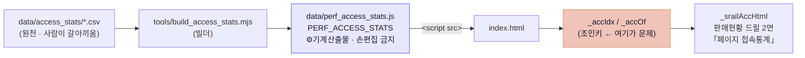

# 청사진 — 공연별 접속통계 14년치 반입 (260806)

> **한 줄**: 붙일 자리는 **이미 있다**(`data/perf_access_stats.js` ← `tools/build_access_stats.mjs` ← `data/access_stats/`).
> 새로 만들 건 없고 **원천을 갈아끼우는 일**이다. 진짜 일은 파이프가 아니라 **조인키** —
> 47건(2026 단년)에선 안 터지던 「이름만 매칭」이 157건(2013~2026)에선 **실제로 오매칭을 낸다**(아래 §2 실증).
>
> 원천 = `docs/260806_공연접속통계_전체.tsv` · 운영자 스크립트 = `docs/260806_stats_ingest.mjs`(둘 다 이 커밋에 보존).
> 이 문서 = 일회성 스냅샷 보고(`docs/reports/` · `check_design` 비대상 · 정본 아님).

---

## 0. 실측 요약 — 이 데이터가 무엇인가

| 항목 | 실측값 |
|---|---|
| TSV 전체 행 | **1,271행** (uid 1~1296 · **uid 유일성 ✓** 1272/1272) |
| 모수 > 0 (실데이터 보유) | **157행** |
| 기간 | **2013 ~ 2026** (기존 CSV = 2026 단년) |
| 누적 접속 합계 | **57,403** |
| 비율 합계 건전성 | 연령 7구간·거주 6구간 **100±1.5 이탈 0건 / 157** ✓ |
| 컬럼 | uid · 번호 · 구분 · 공연장 · **티켓오픈** · 제목 · **모수** + 연령 7 + 거주 6 |

### ✅ 「모수」 = 기존 CSV의 「총 접속수(로그인 회원)」 — **같은 지표다**

추측이 아니라 **대조 실측**이다. 2026 교집합에서 값이 **정확히 일치**했다:

```
대관 결제용 페이지          TSV 97  | CSV 97
2026 실내악 페스티벌 STAY   TSV 136 | CSV 136
김영욱×콜레기움 무지쿰       TSV 380 | CSV 380
브런치 콘서트 … 미술관 여행 I TSV 522 | CSV 522
2026 실내악 페스티벌 <…>    TSV 787 | CSV 787
```

접두 정규화를 맞춘 뒤 **46/47 매칭 · 그중 33건 완전일치 · 13건 증가**. → **컬럼명만 다르고 정의는 동일**하므로
빌더의 헤더 별칭만 늘리면 된다(새 지표 신설 아님).

### ✅ 「살아있는 누적 카운터」 확증 — 13건의 차이 = 6일치 증가분

CSV `asof 2026-07-31` → TSV 수집 `2026-08-06`, 딱 6일. 그 사이 **증가만** 했다:

| 공연 | 07-31 | 08-06 | Δ |
|---|---:|---:|---:|
| 뮤지컬 \<그날들\> | 5,541 | 6,454 | **+913** |
| 라포엠의 Love Rhapsody | 426 | 475 | +49 |
| 음반발매기념 \<조재혁 피아노 리사이틀\> | 316 | 361 | +45 |
| 뮤지컬 \<달 샤베트\> - 여수 | 1,051 | 1,087 | +36 |
| 국립현대무용단 \<트리플 빌\> | 205 | 230 | +25 |
| 폐막연주회 열 번째 심포니 | 113 | 130 | +17 |
| (외 7건, 전부 +) | | | |

운영자 스크립트 머리말의 실측(「uid 1295가 1시간 만에 129 → 130」)과 **같은 방향으로 독립 확인**됐다.
→ **수집일시는 반드시 남긴다.** 값 하나만 보고 「이 공연 접속 6,454」라고 말하면 언제 기준인지가 사라진다.

---

## 1. 붙일 자리 — 이미 있다 (신설 0)

260731 운영자 지시로 만들어진 축이 그대로 있다. **이 축에 얹는다.**



- 화면 = `index.html` `_srailAccHtml`(L8692~) — 한 줄 요약 문장 + KPI 3장(총 접속수·관내 비중·접속 대비 구매) + 연령·지역 분포 막대.
- **인클루드 축 전례** = `data/exhib_daily_2026.js`가 「`data/perf_access_stats.js` 선례 그대로 `<script src>`」로 명시 계승(작업이력 L3425).
- 즉 **새 파일·새 컴포넌트·새 CSS·새 토큰 = 0**. CLAUDE.md 3번 `[디자인]` 「같은 리포지토리 안의 기존 디자인·컴포넌트를 쓴다」 그대로.

---

## 2. ⚠ 진짜 일 — 조인키 (여기를 안 고치면 **틀린 숫자가 화면에 뜬다**)

현행 `_accOf(name)`는 **이름만** 본다(`index.html` L8649~8656). 2026 단년 47건에선 무사했지만, 14년치가 들어오면 깨진다.

### 2-1. 실증 ① — 현행 정규화로는 47건 중 **10건**만 매칭된다

원인은 **`[메인출력]` 접두**다. TSV 제목 **217행**이 대괄호 접두를 달고 있다(`[메인출력]`×209, 그 외 8종).
현행 `_uName`은 대괄호 **기호는 지우지만 안의 글자는 남긴다** → `메인출력뮤지컬그날들` ≠ `뮤지컬그날들`.

| 정규화 | 매칭 | 미매칭 |
|---|---:|---:|
| 현행 `_uName` | **10 / 47** | 37 |
| + 대괄호 접두 제거 | **46 / 47** | 1 |

### 2-2. 실증 ② — 이름만 쓰면 **다른 연도 공연에 붙는다** (조용히 틀린다)

접두를 고쳐도 **연도 축이 없으면** 재연 공연에서 엉뚱한 행을 집는다. 실제로 2건 잡혔다:

| 공연 | 이름만 매칭이 집은 행 | 집었어야 할 행 |
|---|---|---|
| 뮤지컬 \<그날들\> | uid 402 · **2016** · 모수 **3** | uid 1287 · 2026.07 · 모수 **6,454** |
| 뮤지컬 번개맨 시즌2 | uid 1166 · **2025** · 모수 **10** | uid 1251 · 2026.02 · 모수 **328** |

> 번개맨은 처음에 「328 → 10, **-318 감소**」로 보였다. 카운터 후퇴처럼 보였지만 **오매칭이었다**
> (2026행 제목이 전각 `？`를 써서 매칭에 실패 → 2025행이 대신 잡힘). **누적 카운터는 실제로 후퇴한 적 없다.**
> ⚠ 이 함정은 **화면에 에러를 안 낸다** — 그냥 작은 숫자가 조용히 뜬다.

전체 1,271행 기준 **동명 충돌 34개 이름 / 89행**. 그중 모수>0끼리 충돌은 현재 2개지만, **매년 늘어나는 축**이다.

### 2-3. 해법 — 레포에 **이미 정답이 있다** (새 설계 금지)

`_opsLookup(name, year)`(L5525)가 같은 문제를 이미 푼다:

> *「연도 ±1 이내 가장 가까운 에디션만 매칭(재연 오매칭 방지: 2025 판매가 2015 카탈로그에 붙는 것 차단)」*

**`_accOf`를 이 3층 계약으로 승격한다** — 판매현황·운영대장 조인과 **같은 문법**:

| 층 | 키 | 근거 |
|---|---|---|
| ① | 공연ID / uid 직결 | `_opsLookupById` 전례 (「이름 정규화보다 우선」) |
| ② | 정규화이름 + **연도 ±1** | `_opsLookup` 전례 — 재연 오매칭 차단 |
| ③ | 이름만 (**후보가 1개일 때만**) | 종전 동작 = 회귀 0 |

**연도는 어디서 오나** = TSV `티켓오픈`(기존 CSV엔 없던 신규 축). 날짜 결측 16건(모수>0 중)은 `01시`처럼
시각만 남았는데, **uid가 시간순 프록시**(uid 1=2015-06 … uid 1296=2026-08 · 역전 11.5%는 티켓오픈일 기준
정렬 차이)라 이웃 행으로 연도 보간이 가능하다.

### 2-4. ⚠ `_uName`을 직접 고치지 마라 — **공용 조인키다**

`_uName`은 접속통계만 쓰는 게 아니라 **판매현황 ↔ 운영대장 ↔ 프로그램 시트** 조인을 전부 지탱한다
(`_opsIndex` · `_opsLookup` · `_pgFind`). 여기에 문자를 추가하면 **전 조인이 동시에 흔들린다.**

→ **접속통계 전용 `_aName` = `_uName(s)` 한 겹 위에 접두·잔여문자만 더 벗기는 래퍼.** 기존 키 **무접촉**.

벗겨야 할 잔여 문자(실측 빈도순, 현행 `_uName` 미처리분):

```
[접두]×217   &×44   ‘×20   /×13   Ⅱ×10   Ⅰ×9   Ⅲ×7   Ⅳ×6   “×5   ”×5   ＆×5   ？   ［］×3
```

> 미매칭 1건의 정체도 이것이다 — `정명훈의 ‘로미오와 줄리엣’`의 **여는 홑따옴표 `‘`(U+2018)**.
> 현행 `_uName` 문자 클래스엔 닫는 `’`(U+2019)만 있고 **여는 쪽이 빠져 있다.**

---

## 3. 새로 생기는 것 — 커버리지 3.3배

| | 현행 | 반입 후 |
|---|---:|---:|
| 공연 건수 | 47 | **157** (3.3×) |
| 기간 | 2026 단년 | **2013~2026** |
| 누적 접속 | 31,673 | **57,403** |

구분별 (모수>0):

| 구분 | 건수 | 접속 합계 | 화면에 붙을 자리 |
|---|---:|---:|---|
| 기획 | 65 | 43,087 | ✅ 판매현황 드릴 2면 |
| 대관 | **83** | 7,761 | ⚠ **없음** — §5-①(운영자 결정) |
| 공동기획 | 7 | 6,536 | ✅ |
| 기타 | 2 | 19 | — |

- 공연장 = 대극장 123 · 소극장 32 · 기타 2.
- **티켓오픈 = 신규 축.** 기존 CSV엔 없던 열이라, 붙이면 「티켓오픈 후 N일차 접속」 같은 축이 새로 열린다(이번 범위 밖).

---

## 4. 스냅샷 축 — 정적 거울 vs 시트 (**갈림길**)

업로드된 `docs/260806_stats_ingest.mjs`는 **기존 파이프와 다른 축**을 향한다:

| | 현행 파이프 (260731) | 업로드 스크립트 (260806) |
|---|---|---|
| 목적지 | `data/perf_access_stats.js` (git) | `운영_공연접속통계` 시트 (Worker API) |
| 성격 | 정적 거울 · **최신 1벌**(`asof`) | 스냅샷 **누적**(`mode:append` + 수집일시) |
| 비용 | 0 (빌드타임) | 인증·API 왕복 |
| 화면 연결 | ✅ 이미 배선됨 | ❌ 읽는 화면 없음 |

**권고 = Phase 1은 정적 거울만.** 근거 셋:
1. **화면이 요구하지 않는다** — `_srailAccHtml`은 최신 1벌만 읽는다. 시계열을 그리는 자리가 아직 없다.
2. **레포 전례** — `exhib_daily_2026.js`가 이 선례를 명시 계승했다. 같은 성격(주기 낮은 수동 수집 거울)이면 같은 축.
3. **빌드 큐 절과 무충돌** — 「빌드 우회 서빙(Worker API) 동반 배선」 규칙은 **정기 봇 커밋 축을 신설할 때만** 걸린다.
   이 반입은 수동·비정기라 그 축을 안 만든다.

> 시트 축은 **폐기가 아니라 보류**다. 「접속 증가 속도」처럼 **시계열이 실제로 화면에 필요해지면** 그때 켠다
> (그때는 스크립트가 이미 있으니 비용이 낮다). 지금 켜면 읽는 데 없는 데이터를 운영 시트에 쌓는 일이 된다.
>
> ✅ **PII 점검 완료** — 이 데이터는 제목 + 집계 비율뿐, 개인 식별 정보 0.
> Worker `PII_SHEETS`(운영_회원·운영_예매·운영_예매집계) 축과 무관하고, 같은 성격의
> `data/access_stats/2026_공연별_접속통계.csv`가 이미 공개 레포에 커밋돼 있다(전례 일치).

---

## 5. 🚦 운영자 결정 필요 — 세션이 임의로 못 정하는 것

### ① 대관 83건(7,761)을 화면에 태울 것인가 — **가장 큰 갈림길**

지금 화면엔 **붙을 자리가 없다.** 대관은 구글 캘린더에서 「프로그램」 시트로 편입되지만
**홍보노출 N · `PERFS_GC`로 분리**돼 판매현황 레일 밖에 있다(앱지침 「대관 DB 통합」 절).
→ 데이터의 **53%(83/157건)** 가 반입해도 안 보인다.

선택지: (a) 반입만 하고 화면은 공연만 (b) 대관 진입점 신설 (c) 대관 제외 반입.
**이건 값 선택이 아니라 범위 결정이라 운영자 몫.**

### ② 과거 연도(2013~2025) 92건의 진입 경로

판매현황 레일은 **진행 공연 축**이다. 종료 공연은 `_anaPeers`(또래 비교)엔 들어가지만
드릴 2면까지 도달하는 경로가 있는지 별도 확인 필요. 없으면 반입해도 열람 불가.

### ③ 원천 파일 형식 — CSV 변환 vs 빌더가 TSV도 읽기

현행 빌더는 `data/access_stats/*.csv`만 읽는다. **권고 = 빌더가 TSV도 읽게 확장**
(운영자가 관리자 화면에서 긁은 원형을 변환 없이 그대로 넣는 게 사고가 적다).
컬럼 별칭(`제목`→`공연명`, `모수`→`총 접속수`, `거주_*`→지역)도 같이 넣는다.

---

## 6. 단계 — 무엇을 어떤 순서로

| Phase | 하는 일 | 산출 | 게이트 |
|---|---|---|---|
| **0** | (이 문서) 실측·조인키 진단 | 이 보고 | — |
| **1** | 원천 반입 + 빌더 확장(TSV·별칭·`수집일시`) | `data/access_stats/` · `build_access_stats.mjs` | 빌더 자체 검산 |
| **2** | **조인키 승격** `_accOf` 3층 + `_aName` 래퍼 | `index.html` | 킬테스트(§7) |
| **3** | 화면 — 기준일 표기 · (대관은 ① 결정 후) | `_srailAccHtml` | 전/후 스크린샷 |
| **4** | 게이트 등재 | `docs/절대명령2_정본인덱스.md` | 킬테스트 실증 |

**Phase 1·2는 분리한다.** 원천만 갈아끼우고 조인키를 안 고치면 §2-2의 오매칭이 **그 순간 화면에 실현된다**
(157건이 들어오는 즉시 동명 충돌이 활성화). 둘은 같은 PR로 가되 **커밋은 나눈다.**

---

## 7. 게이트 — 빌더 검산 (레포 전례 계승)

`tools/build_annual_yr.mjs`의 **「후퇴 = 거울 낡음 신호로 거부」** 원칙이 여기에 **그대로 적용된다.**
접속통계는 누적 카운터라 **줄어들 수 없다** — 줄었다면 원천이 낡았거나 조인이 틀린 것이다.
(실측 260804에 라이브 9,568을 낡은 거울 4,210으로 되돌릴 뻔한 걸 막은 그 규칙.)

빌더가 걸 검산 4종:

1. **비율 합계** 연령·거주 각 100±1.5 이탈 = 경고 (현재 이탈 0/157)
2. **모수 후퇴 거부** — 같은 uid의 값이 이전 산출보다 작으면 **거부**(§0에서 6일 +913 실측 = 단조 증가가 정상)
3. **uid 유일성** (현재 1272/1272 ✓)
4. **조인 미매칭 리포트** — 몇 건이 어느 공연에도 안 붙었는지 **숫자로 찍는다**(침묵 금지)

> **킬테스트 없이는 게이트를 등재하지 않는다**(정본인덱스 등재 의무).
> Phase 4에서 일부러 위반 1건(예: 모수 1 감소)을 만들어 rc=1을 실측하고 그 사실을 등재 줄에 남긴다.

---

## 8. 손대지 않는 것 (회귀 차단선)

- `data/perf_access_stats.js` **손편집 금지** — 기계산출물. 값이 틀리면 **빌더를 고친다**.
- `_uName` **무접촉** — 공용 조인키(§2-4).
- `_srailRenderDrill` **1면 무접촉** — 260801 계약(「1면 본문은 종전 그대로」).
- 디자인 = 신규 토큰·raw hex·컴포넌트 **0**. 분포 막대는 `_memOvRender` 계승분 그대로.
- 과거 연도 `_YR` 연간실적 **무관** — 접속통계는 실적 축이 아니다(거울로 과거 재생성 금지 규칙과 무충돌).
